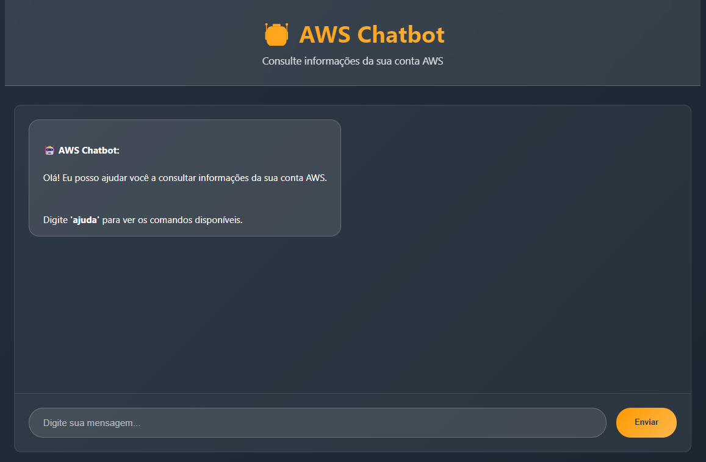

# AWS Chatbot

> 🏆 **Projeto para TDC 2025 - Q Developer Quest**

Um chatbot web interativo para consultar informações da sua conta AWS usando Flask e boto3.

## 💡 Problema que Inspirou a Ideia

Muitos desenvolvedores e administradores de sistemas precisam constantemente verificar informações básicas da conta AWS, como:
- Custos atuais e estimativas
- Status de recursos (EC2, S3)
- Contagem de arquivos em buckets

Essas consultas geralmente requerem navegar pelo console AWS ou executar múltiplos comandos CLI. A ideia foi criar uma interface conversacional simples que centralize essas consultas em um chatbot amigável.

## 🛠️ Como a Solução Foi Construída

Este projeto foi desenvolvido com **Amazon Q Developer** utilizando:

- **Backend:** Flask + boto3 para integração com serviços AWS
- **Frontend:** HTML/CSS/JavaScript com design inspirado na AWS
- **Serviços AWS:** S3, EC2, Cost Explorer
- **Autenticação:** AWS CLI com suporte a SSO



## 📝 Prompts Utilizados com Amazon Q Developer

1. **Prompt inicial (Criação do projeto):**
   ```
   Quero que você crie um repositório completo e funcional em Python para um projeto de chatbot conectado aos serviços da AWS.
   O repositório deve estar pronto para ser publicado no GitHub e conter toda a documentação necessária para que qualquer pessoa consiga clonar e executar o projeto de forma simples.

   Objetivo do projeto:
   O sistema será um chatbot web que permite ao usuário conversar e obter informações sobre sua conta da AWS.
   O chatbot deve ser capaz de responder perguntas como:
   - Estimativa de custos da conta;
   - Quantos arquivos existem em determinado bucket S3;
   - Quais instâncias EC2 estão rodando;
   - Outras informações possíveis usando os serviços da AWS.

   O projeto deve utilizar Flask para criar uma aplicação web onde o usuário poderá interagir com o chatbot por meio de uma interface visual (não apenas terminal).
   A interface deve seguir um estilo inspirado no site da AWS: cores sóbrias (tons de azul, cinza e branco), layout responsivo, um campo de entrada de mensagem e uma área de exibição do chat.
   ```

2. **Prompt de melhoria (AWS CLI e SSO):**
   ```
   Muito bom! Acho que precisamos incluir uma orientação para a pessoa baixar o aws CLI e dar um aws sso login para poder conectar com a lib boto3, n
   ```

3. **Prompt de documentação (TDC 2025):**
   ```
   Muito bom! Precisamos incluir também essas informações

   Cada projeto deve trazer um README.md contendo:
   Qual problema inspirou a ideia
   Como a solução foi construída
   Instruções para rodar
   Próximos passos

   Etapa 1: Bolsinha cabos exclusiva AWS
   Um projeto gerado com Amazon Q Developer ou Amazon Q Developer CLI
   Projeto público no Github (com a tag q-developer-quest-tdc-2025)
   README.md (com screenshot do projeto rodando)
   Lista dos prompts utilizados no README.md
   ```

4. **Prompt de implementação (Etapas 2 e 3):**
   ```
   Vamos implementar as próximas etapas como o diagrama de arquitetura e testes automatizados
   ```

5. **Prompt de finalização (Etapa 4):**
   ```
   Muito bom! Agora, vamos prosseguir com a etapa 4 de forma completa. Além disso, quero que você atualize o readme e o arquivo de prompts com os prompts que eu te passei. Faça também uma verificação completa em todo o repositório e em todos os arquivos que criamos para ver se há algo para ser corrigido.
   ```

## ✨ Funcionalidades

- **Estimativa de custos** da conta AWS
- **Listagem de buckets S3** e contagem de arquivos
- **Status das instâncias EC2**
- **Interface web responsiva** com design inspirado na AWS
- **Integração completa** com serviços AWS via boto3

## 📋 Pré-requisitos

- Python 3.8+
- Conta AWS ativa
- AWS CLI instalado

## 🛠️ Instalação

1. **Clone o repositório:**
```bash
git clone https://github.com/seu-usuario/aws-chatbot.git
cd aws-chatbot
```

2. **Crie um ambiente virtual:**
```bash
python -m venv venv
source venv/bin/activate  # Linux/Mac
# ou
venv\Scripts\activate     # Windows
```

3. **Instale as dependências:**
```bash
pip install -r requirements.txt
```

4. **Instale e configure o AWS CLI:**

**Instalação do AWS CLI:**

- **Windows:** Baixe o instalador em https://aws.amazon.com/cli/
- **macOS:** `brew install awscli` ou baixe o instalador
- **Linux:** `sudo apt install awscli` ou `sudo yum install awscli`

**Configuração de credenciais (escolha uma opção):**

**Opção 1 - AWS SSO (Recomendado):**
```bash
aws configure sso
# Siga as instruções para configurar SSO
# Depois faça login:
aws sso login
```

**Opção 2 - AWS CLI tradicional:**
```bash
aws configure
# Digite suas credenciais quando solicitado
```

**Opção 3 - Variáveis de ambiente:**
```bash
export AWS_ACCESS_KEY_ID=sua_access_key
export AWS_SECRET_ACCESS_KEY=sua_secret_key
export AWS_DEFAULT_REGION=us-east-1
```

**Opção 4 - Arquivo .env:**
```bash
cp .env.example .env
# Edite o arquivo .env com suas credenciais
```

## 🚀 Execução

**Se usando AWS SSO, faça login antes de executar:**
```bash
aws sso login
```

**Execute a aplicação:**
```bash
python app.py
```

Acesse: http://localhost:5000

## 🧪 Executar Testes

**Executar todos os testes:**
```bash
python run_tests.py
```

**Executar testes específicos:**
```bash
# Testes unitários
pytest tests/test_app.py -v

# Testes de integração
pytest tests/test_integration.py -v

# Com cobertura de código
pytest tests/ --cov=. --cov-report=html
```

## 💬 Comandos do Chatbot

- `custos` - Mostra estimativa de custos da conta
- `s3 buckets` - Lista todos os buckets S3
- `s3 arquivos nome-do-bucket` - Conta arquivos em um bucket específico
- `ec2 instancias` - Lista instâncias EC2 e seus status
- `ajuda` - Mostra todos os comandos disponíveis

## 🏗️ Estrutura do Projeto

```
aws-chatbot/
├── app.py              # Aplicação Flask principal
├── aws_services.py     # Integração com serviços AWS
├── cost_calculator.py  # Calculadora de custos
├── requirements.txt    # Dependências Python
├── Dockerfile         # Container Docker
├── .dockerignore      # Arquivos ignorados no build
├── .env.example       # Exemplo de configuração
├── architecture.md     # Diagrama de arquitetura
├── COST_ANALYSIS.md   # Análise detalhada de custos
├── PROMPTS.md         # Lista completa de prompts
├── run_tests.py       # Script para executar testes
├── pytest.ini        # Configuração do pytest
├── .amazonq/          # Configuração Amazon Q Developer
│   ├── config.json    # Configuração principal
│   └── rules/         # Regras do projeto
├── mcp/               # Servidor MCP
│   ├── server.py      # Servidor MCP
│   └── mcp_config.json # Configuração MCP
├── infrastructure/    # IaC (Terraform)
│   ├── main.tf        # Configuração principal
│   ├── ecs.tf         # ECS Fargate
│   ├── alb.tf         # Load Balancer
│   ├── iam.tf         # IAM roles
│   ├── terraform.tfvars.example # Variáveis exemplo
│   └── README.md      # Documentação deploy
├── static/
│   ├── style.css      # Estilos CSS
│   └── script.js      # JavaScript do frontend
├── templates/
│   └── index.html     # Template HTML principal
├── tests/
│   ├── __init__.py    # Pacote de testes
│   ├── test_app.py    # Testes unitários Flask
│   ├── test_aws_services.py  # Testes unitários AWS
│   └── test_integration.py   # Testes de integração
└── README.md          # Documentação principal
```

## 🔧 Configuração Avançada

### Permissões AWS Necessárias

Certifique-se de que sua conta AWS possui as seguintes permissões:

```json
{
    "Version": "2012-10-17",
    "Statement": [
        {
            "Effect": "Allow",
            "Action": [
                "s3:ListAllMyBuckets",
                "s3:ListBucket",
                "ec2:DescribeInstances",
                "ce:GetCostAndUsage",
                "ce:GetUsageReport"
            ],
            "Resource": "*"
        }
    ]
}
```

## 🤝 Contribuição

1. Fork o projeto
2. Crie uma branch para sua feature (`git checkout -b feature/AmazingFeature`)
3. Commit suas mudanças (`git commit -m 'Add some AmazingFeature'`)
4. Push para a branch (`git push origin feature/AmazingFeature`)
5. Abra um Pull Request

## 📝 Licença

Este projeto está sob a licença MIT. Veja o arquivo [LICENSE](LICENSE) para mais detalhes.

## 🏗️ Arquitetura

Veja o [diagrama de arquitetura completo](./architecture.md) com fluxos de dados e componentes.

## 🤖 Servidor MCP

O projeto inclui um servidor MCP (Model Context Protocol) para integração com Amazon Q Developer:

```bash
# Executar servidor MCP
python mcp/server.py

# Configurar no Amazon Q Developer
# Use o arquivo mcp/mcp_config.json
```

## 🚀 Deploy na AWS

Veja a [documentação completa de deploy](./infrastructure/README.md) usando Terraform.

**Deploy rápido:**
```bash
cd infrastructure/
terraform init
terraform plan
terraform apply
```

## 🚀 Próximos Passos

- [x] **Etapa 1:** Projeto funcional com Amazon Q Developer ✅
- [x] **Etapa 2:** Diagrama de arquitetura e testes automatizados ✅
- [x] **Etapa 3:** Servidor MCP + IaC + Configuração Amazon Q ✅
- [ ] **Etapa 4:** Incluir estimativa de custos da solução
- [ ] Adicionar mais serviços AWS (RDS, Lambda, CloudWatch)
- [ ] Implementar autenticação de usuários
- [ ] Criar dashboard com métricas visuais
- [ ] Adicionar notificações em tempo real

## 💰 Estimativa de Custos

### Custos de Desenvolvimento (Gratuito)
- AWS Free Tier para testes
- Serviços utilizados dentro dos limites gratuitos

### Custos de Produção (Estimativa mensal)
- **EC2 t3.micro:** ~$8.50/mês
- **Application Load Balancer:** ~$16.20/mês
- **Route 53:** ~$0.50/mês
- **Chamadas API AWS:** ~$1.00/mês
- **Total estimado:** ~$26.20/mês

*Valores podem variar conforme uso e região AWS*

## 🏷️ Tags

`q-developer-quest-tdc-2025` `aws` `chatbot` `flask` `boto3` `python`

## ⚠️ Aviso

Este projeto é para fins educacionais. Sempre revise as permissões AWS e monitore os custos ao usar serviços da AWS.