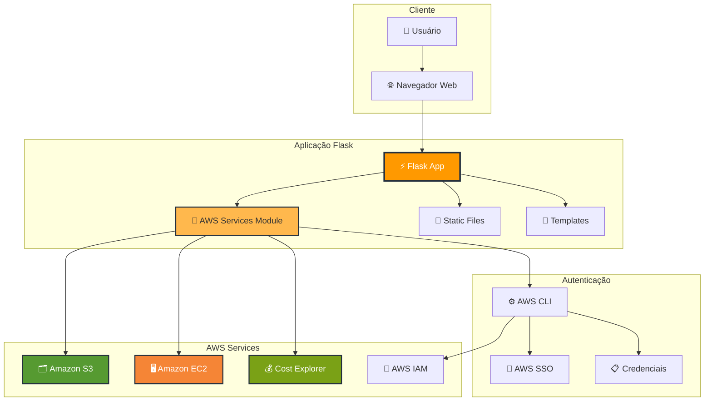
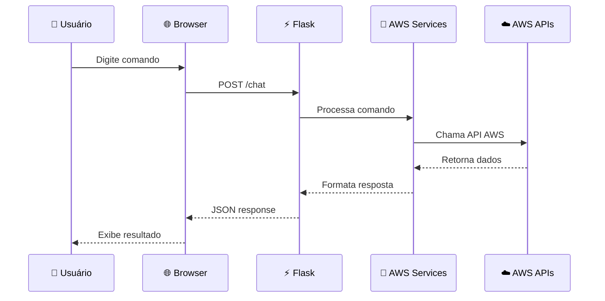

# 🏗️ Diagrama de Arquitetura

## Arquitetura da Solução

## Fluxo de Dados

## Componentes Principais

### 🖥️ Frontend
- **HTML/CSS/JS**: Interface responsiva inspirada na AWS
- **WebSocket**: Comunicação em tempo real (futuro)
- **Responsive Design**: Compatível com mobile e desktop

### ⚡ Backend (Flask)
- **app.py**: Servidor principal e rotas
- **aws_services.py**: Integração com APIs AWS
- **Middleware**: Tratamento de erros e logging

### ☁️ AWS Services
- **S3**: Listagem de buckets e objetos
- **EC2**: Status de instâncias
- **Cost Explorer**: Análise de custos
- **IAM**: Autenticação e autorização

### 🔐 Segurança
- **AWS SSO**: Autenticação moderna
- **IAM Roles**: Permissões granulares
- **Environment Variables**: Configurações sensíveis

## Padrões de Design

- **MVC Pattern**: Separação de responsabilidades
- **Service Layer**: Abstração das APIs AWS
- **Error Handling**: Tratamento robusto de exceções
- **Configuration Management**: Variáveis de ambiente